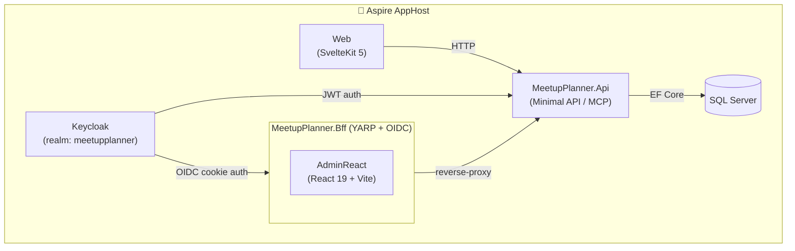

# MeetupPlanner

MeetupPlanner is a full-stack application for organising and managing tech meetup events. It handles the full lifecycle of a meetup: scheduling events at venues, registering speakers and their presentations, building an agenda (schedule slots), and tracking RSVPs and attendance.

## What it does

- **Meetups** – create and manage events with title, description, start/end times, location, status (Scheduled, Published, Cancelled, Completed), capacity, and RSVP counts (yes / no / waitlist / attended).
- **Locations** – maintain a catalogue of venues/sponsors with address and capacity. A location must exist before a meetup can be created at it.
- **Speakers** – speaker profiles with biography, social links (LinkedIn, GitHub, Twitter/X, blog), company, and photo URL.
- **Presentations** – talk abstracts with duration, status, and optional slides/repo links. Presentations are linked to one or more speakers.
- **Schedule** – ordered `ScheduleSlot` entries inside each meetup, each optionally linked to a presentation.
- **RSVP tracking** – track total spots and the breakdown of yes/no/waitlist/attendance counts per meetup.
- **MCP endpoint** – the API exposes an [MCP](https://modelcontextprotocol.io) server at `/mcp` so AI assistants can query meetups, speakers, and locations.

## Architecture

The solution is a .NET 10 multi-project application orchestrated locally by **Aspire** (`src/AppHost`).



| Project | Role |
|---|---|
| `src/AppHost` | Aspire orchestrator – wires up all services for local dev |
| `src/MeetupPlanner.Api` | ASP.NET Core minimal API – primary backend; also hosts the MCP server |
| `src/MeetupPlanner` | Core domain library – all business logic, EF Core models, feature modules |
| `src/MeetupPlanner.Bff` | Backend-for-frontend – Keycloak OIDC cookie auth, YARP reverse proxy to API + React admin |
| `src/MeetupPlanner.AdminReact` | React 19 + Vite admin frontend (Tailwind CSS v4), served through the BFF |
| `src/Web` | SvelteKit 5 public-facing website (Tailwind CSS v4) |
| `src/MeetupPlanner.ServiceDefaults` | Shared Aspire service defaults (telemetry, health checks) |
| `src/MeetupPlanner.Shared` | Shared response DTOs referenced by multiple backend projects |
| `src/MeetupPlanner.Proxy` | YARP reverse proxy (work in progress) |
| `tests/MeetupPlanner.Api.Tests` | Unit tests (TUnit) |
| `tests/MeetupPlanner.Api.IntegrationTests` | Integration tests (TUnit + `TestWebApplicationFactory`) |

## Running locally

### Prerequisites
- .NET 10 SDK
- Docker (for SQL Server and Keycloak)
- Node.js (for SvelteKit / React frontends, managed automatically by Aspire)

### With Aspire (recommended)

The Aspire AppHost starts all services, including Keycloak (with realm import from `config/keycloak`) and expects an external SQL Server connection string named `MeetupPlanner`.

```powershell
dotnet run --project src/AppHost
```

Open the Aspire dashboard at `http://localhost:15888` to see all running services and their logs.

### API only (without Aspire)

Start a SQL Server instance:

```powershell
docker run -e "ACCEPT_EULA=Y" -e "SA_PASSWORD=Your_password123" -p 1433:1433 -d mcr.microsoft.com/mssql/server:2022-latest
```

Run the API:

```powershell
dotnet run --project src/MeetupPlanner.Api
```

Optionally, run the standalone Aspire Dashboard for telemetry:

```powershell
docker run --rm -it -p 18888:18888 -p 4317:18889 -d --name aspire-dashboard `
  -e DOTNET_DASHBOARD_UNSECURED_ALLOW_ANONYMOUS='true' `
  mcr.microsoft.com/dotnet/aspire-dashboard:latest
```

### SvelteKit frontend

```powershell
cd src/Web
npm install
npm run dev
```

### React admin frontend

```powershell
cd src/MeetupPlanner.AdminReact
npm install
npm run dev
```

## Build

```powershell
# Build entire solution
dotnet build MeetupPlanner.slnx

# Run all tests
dotnet test MeetupPlanner.slnx
```

### Build and publish API container image

```powershell
dotnet publish -t:PublishContainer -p:ContainerImageTags=latest --no-restore `
  -p:ContainerRepository=meetupplanner/api -p:VersionSuffix=beta1
```

### Push to Azure Container Registry

```powershell
docker login mycontainerregistry.azurecr.io

dotnet publish .\src\MeetupPlanner.Api\MeetupPlanner.Api.csproj `
  -t:PublishContainer -p:ContainerImageTags='"latest"' `
  -p:VersionSuffix=test1 -p:ContainerRegistry=mycontainerregistry.azurecr.io
```

Replace `mycontainerregistry.azurecr.io` with your Azure Container Registry name.

## Authentication

The API validates Keycloak JWT bearer tokens (realm `meetupplanner`, audience `meetupplanner-api`). When running via Aspire, Keycloak is started automatically.

For quick local testing without Keycloak, you can use `dotnet user-jwts`:

```powershell
# Create a token
dotnet user-jwts create --project .\src\MeetupPlanner.Api\MeetupPlanner.Api.csproj

# Use the token
curl -i -H "Authorization: Bearer <TOKEN>" https://localhost:7119/meetupplanner/meetups
```

> **SDK bug workaround:** dotnet SDK ≤ 9.0.102 generates `ValidIssuer` instead of `ValidIssuers` in `appsettings.Development.json`, causing [IDX10500](https://github.com/dotnet/aspnetcore/issues/59277). Fix it manually:
> ```json
> "Authentication": {
>   "Schemes": {
>     "Bearer": {
>       "ValidAudiences": ["http://localhost:5016", "https://localhost:7119"],
>       "ValidIssuers": ["dotnet-user-jwts"]
>     }
>   }
> }
> ```

## Running the API in Docker with HTTPS

Generate a dev certificate:

```powershell
dotnet dev-certs https -ep $env:USERPROFILE\.aspnet\https\aspnetapp.pfx -p <PASSWORD>
dotnet dev-certs https --trust
```

Run the container:

```powershell
docker run --rm -it -p 7119:8080 `
  -e ASPNETCORE_URLS="https://+:8080;" `
  -e ASPNETCORE_ENVIRONMENT=Development `
  -e ASPNETCORE_HTTPS_PORT=7119 `
  -e ASPNETCORE_Kestrel__Certificates__Default__Password="<PASSWORD>" `
  -e ASPNETCORE_Kestrel__Certificates__Default__Path=/https/aspnetapp.pfx `
  -v $env:USERPROFILE\.aspnet\https:/https/ `
  -v $env:APPDATA\microsoft\UserSecrets\:/root/.microsoft/usersecrets `
  --user root `
  meetupplanner/api:latest
```